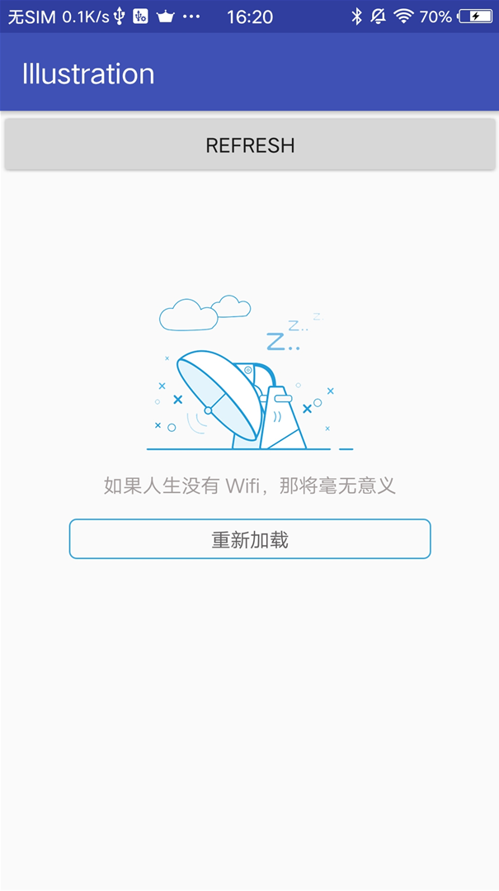
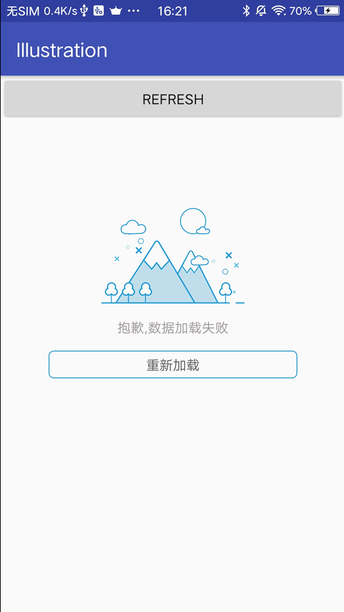

# DefaultPage
缺省页插画（加载中，无网络，加载失败）封装，可灵活自定义插画

##### 加载中效果图

##### 无网络效果图

##### 加载失败效果图

##### 加载成功效果图

## 使用

xml ：将 IllustrationLayout（继承自 FrameLayout） 作为父容器

	 <com.jarylan.illustrationlayout.IllustrationLayout
			android:layout_width="match_parent"
        	android:layout_height="wrap_content">
	
		...

	</com.jarylan.illustrationlayout.IllustrationLayout>

JAVA 代码 ：添加你需要的插图类（可继承 BaseIllustration 自定义）

	loadlayout.addIllustrationView(new LoadingIllustration())
                .addIllustrationView(new LoadFailIllustration())
                .addIllustrationView(new NetworkErrorIllustration())
                .setOnReloadListener(new OnReloadListener() {
                    @Override
                    public void onReload(View v) {
						
						//重新加载逻辑
						//loadlayout.getCurrentIllustration() 用来判断当前插图                     

                    }
                });

	loadlayout.showSuccessIllustration();//加载成功
	loadlayout.showIllustration(LoadFailIllustration.class,String describe)//显示插画，可添加描述替换 xml 显示的内容
	loadlayout.showIllustration(NetworkErrorIllustration.class);//显示插画，不替换描述内容
